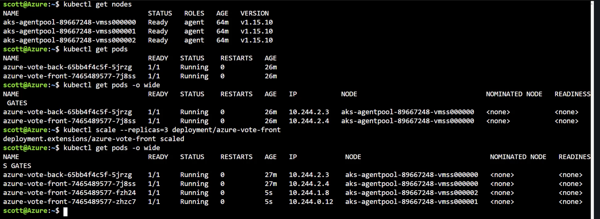
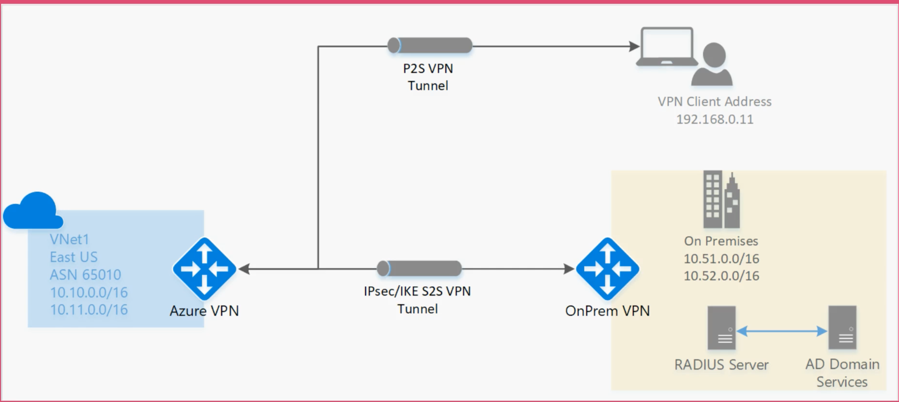
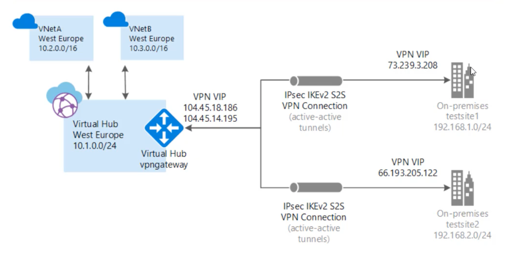
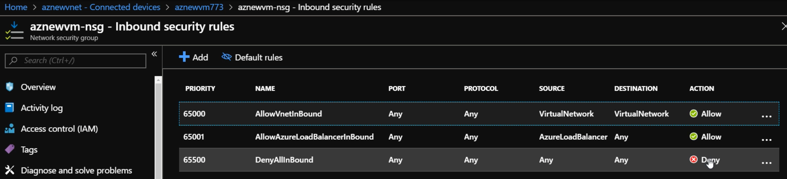
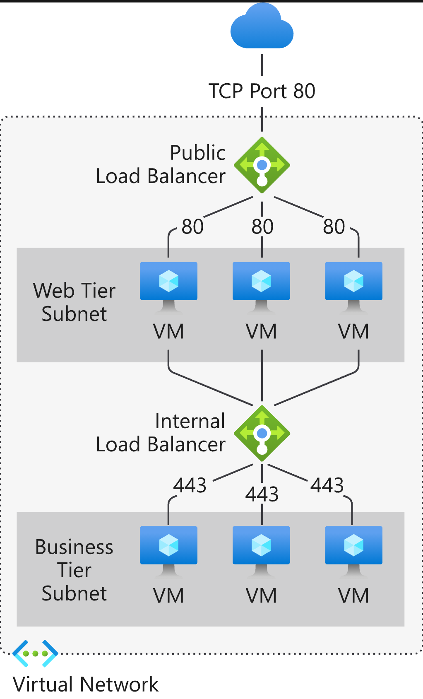

### [_Skills measured_](https://docs.microsoft.com/en-us/learn/certifications/exams/az-104)

- _Manage Azure identities & governance (15-20%)_
- _Implement & manage storage (10-15%)_
- _Deploy & manage Azure compute resources (25-30%)_
- _Configure & manage virtual networking (30-35%)_
- _Monitor & back up Azure resources (10-15%)_

---

### Azure concepts

- ✔️ Feb 27
- Core services - Virtual machines, virtual networking & storage
- Virtual machines can be placed on a virtual network (VNet) - Arranged in "availability sets", placed behind "load balancers" - Abstractions: Azure Batch, Virtual Machine Scale Sets, AKS, Service Fabric
- App services - Web or container apps, fully managed servers, supports major runtimes like Python & Node.js - Benefits in scaling, CI, deployment slots
- Azure storage - Blobs, queues, tables, files - Storage tiers (hot, cool, archive) - Managed or unmanaged - Various levels of replication, local & global
- Data services (SQL server related) - Azure SQL Database, Azure SQL Managed Instance - Non SQL: Cosmos DB, Azure Database for MySQL, MariaDB, Azure Cache for Redis
- Microservices - Service Fabric, Azure Functions, API Management, AKS (a containerized app)
- Networking - Connectivity: VNet, ExpressRoute, VPN Gateway, Azure DNS, Peering, Bastion - Security: Network Security Groups, Azure Private Link, DDoS Protection, Azure Firewall - Delivery: CDN, Azure Front Door, Application Gateway, Load Balancer, Traffic Manager - Monitoring: Network Watcher, Azure Monitor, VNet Terminal Access Point (TAP)

### Powershell & CLI

- ✔️ Feb 27
- Predictable commands
  - | CLI vnet                 | CLI vm         | PowerShell vm | Powershell vnet           |
    | ------------------------ | -------------- | ------------- | ------------------------- |
    | `az network vnet list`   | `az vm list`   | `Get-AzVM`    | `Get-AzVirtualNetwork`    |
    | `az network vnet create` | `az vm create` | `New-AzVM`    | `New-AzVirtualNetwork`    |
    | `az network vnet delete` | `az vm delete` | `Remove-AzVM` | `Remove-AzVirtualNetwork` |

### Manage resource groups

- ✔️ Feb 27
- ARM (Azure Resource Manager) for Resource Groups (RG) - Organization structure for Azure resources, makes it easy to group resources for testing/projects/etc. - All resources within the RG will be deleted if the RG is deleted
- Locks prevent the content of the RG from changing, making it read-only - E.g., a lock won't allow you to even stop a VM in a RG
- For certain resources, like storage accounts, you must declare a resource group at creation
- You can assign policies to RGs, e.g., only allow resources creation in RG to certain regions
- You can move resources to other RGs, other subscriptions or other regions (_You can put a RG is any region, & you can put resources from any region within this resource group_)

### Manage subscriptions & governance

- ✔️ Feb 27
- Account - aka User - A person (user) or a program (app), person would have username, password, MFA, while a program could be an app with a managed identity - Serves as the basis for authentication
- Tenant - Representation of an organization/company - A dedicated instance of Azure AD - _Every Azure Account is part of at least 1 Tenant_ - Usually represented by a public domain name
  - Tenants need not have subscriptions (meaning they can't create resources) - Tenants can have more than 1 Subscription
- Subscription - Agreement with Microsoft to use Azure services, & how you're going to pay - All Azure resource usage gets billed to the payment method of the subscription - Free, pay as you go, enterprise agreements
- Accounts are basically assigned roles within Tenants so there can be more than 1 Account as an owner (i.e., admin) in a Tenant - Grant other Accounts to be part of the Tenant
- Resource - Entity managed by Azure - E.g., VM, web app, storage account, & these "expected" resources often create "unexpected" resources like, public IP address, network interface card, network security group, etc.
- Accounts can be given read, update, owner rights to resources
- Resource Group (RG) - Way of organizing resources in a subscription - _All resources must belong to only 1 RG_ - Good way to separate out projects & isolate resources by project - Deleting RG deletes all resources inside
- Role assignments - E.g., (from highest access to lowest) - Owner: allows you to grant permissions to other people - Contributor: can CRUD resources they have permissions for - Reader: read only
- Policy - Define to enforce company standards & SLAs - E.g., (built-in policies) enforce tag & its value, allowed locations, allowed VM SKUs (Stock Keeping Unit), not allowed resource types, etc. - Policy scope - Can be set at subscription level or RG
- E.g., Subscriptions help you know which customer/client should be billed for a resource/RG if you're a digital consultancy firm servicing multiple clients
- Management Groups - Helps you manage access, policy, & compliance by grouping multiple Subscriptions together - E.g., you can assign Users to Management Groups if, e.g., you need a User to have access to multiple Subscriptions being covered in that Management Group
- At the lowest level you have a User (Account), & that User is part of a Tenant in AD, that Tenant has Subscriptions, & Subscriptions can get organized into Management Groups
- Azure policies would only highlight compliance of existing resources & _enforce the policy restrictions on new resources_ - E.g., if you created a policy to not allow (Not allowed resource types) VNets & VMs at the RG level, but you had existing VMs, the state of _those_ VMs would remain as is, they _will not get deallocated_

### Monitor resources by using Azure Monitor

- ✔️ Feb 28
- Monitor - Get full stack visibility, find & fix problems, optimize your performance, & understand customer behavior all in 1 place - Look at metrics & log, & setup alerts & actions - Home for diagnostics
- For VMs to be able to log, you have to install a diagnostics Agent on it & then give it a Storage Account - You can also set custom performance counters for things like CPU, memory, network & disk, & decide on the rate of logging
- Baseline Environment using ARM templates - Go to Deployments in a RG & export the Deployment templates & parameters to have the baselines - This way, if something happens to your resources (or you want to revert to a former state) you can redeploy them - _Sounds like it's Azure's CloudFormation, also akin to Terraform IaC_
- Can also go to Automation script under a specific resource to get templates & parameters for the _current state_ of that resource (not available for _all_ resources & there could also be dependency issues where associated resources ("unexpected") aren't included)
- Create alerts - E.g., set alerts to know when a web app was stopped - Build this out by creating a rule & action group (email/SMS/invoke Azure function/webhook)
- Create metrics - Reports that you generate on the fly to keep track of your resources, their usage, network traffic, etc.
- Log Analytics - Allows you to search through resource logs, you have to connect the resource to the workspace first - Queries are similar to SQL queries, e.g., you can search for log records associated with when a specific VM started up in the last hour

### Create & configure storage accounts

- ✔️ Feb 28
- Azure Storage is for Azure Blobs (objects), Azure Data lake Storage Gen2, Azure Files, Azure Queues (e.g., FIFO/LIFO), & Azure Tables (stores data in columns & rows)
- Costs will vary depending on the region, performance/access tier, replication, account kind (e.g., general purpose V2), etc.
- Can be accessible only in VNets (hence within subnets as well) or be accessible to all networks - If you select VNet you won't be able to access yourself even in the portal, so you'll need to whitelist your IP address
- Blob accounts live within Storage Accounts, & they have containers for objects (containers akin to S3 buckets)
- Block blobs are fine for most use bases - Page blobs for partial updates - Append blobs for adding to a file
- Blob Storage (another kind of Storage Account kind, in addition to General Purpose V1 & V2) - Different from other kinds because _they only store Blobs_ - Can use to host public documents like images/documents/etc.
- Use Access Keys to authenticate your apps when making requests to Azure Storage Accounts (you're provided with 2 keys) - Keys can be regenerated if compromised
- SAS (Shared Access Signature): URI that grants restricted access rights to Azure Storage resources - Can set time limits, which storage resources can be accessed, IP addresses, protocol, & CRUD permissions - Use this when you don't want to provide Access Keys - Essentially a _token_
- Redundant Storage - Locally-redundant (replications (3 copies) in the same data center/region), geo-redundant (replicates to another region (region-pairs), e.g., if you're in Canada Central, it'll replicate to Canada East) & read-access geo-redundant options available for most regions, some regions will have more options available
- You can set a failover, so in the e.g., above, you can set Canada East as the Primary for failover
- If read-access geo-redundant replication chosen you'll have a secondary endpoint to access in case the primary is down (file service won't have a secondary endpoint for some reason)
- RBAC (Role-Baed Access Control) Authentication for Storage - Use Role Assignments to give Apps/Users access to Storage Accounts - There are a lot of specific storage resource based Roles, they are all under "Storage \*"
- Access Tiers - Implication related to how much you're going to get charged for storage & access (2 distinct concepts) - Going for _"Cool" will halve your storage costs but double your access costs (paying twice for read/write) when compared to "Hot"_ - Can set on a file basis too, e.g., you can set 1 file that you know will hard be used in a container to "Cool" while leaving others in the container to "Hot"
- All Access Tiers from most expensive to least: Premium (8x more expensive compared to Hot for storage, but 1/3 of Hot for read/write operations), Hot, Cool, Archive
- Lifecycle Management: Use policies to transition your data to the appropriate access tiers or expire (delete) at the end of the data's lifecycle
- Object Replication: When enabled, blobs are copied asynchronously from a source storage account to a destination account - You can set up replication rules where you declare the source container & the destination container, filters (add prefix match), & what exactly you want to copy over (e.g., only new object/all files/etc.)
- Only the General Purpose V2 & Blob storage account types support the Archive access tier
- Blob Storage account can be used to make all sorts of files publically accessible, like images/documents/static website files - But using a CDN is a more optimized way of serving these static files to users around the world (using caching) - CDN is a global resource & does not live in any region - 4 pricing tiers, with the cheapest 1 being the Microsoft 1, & the most expensive being the Premium Verizon (there is also a Standard Akamai in the middle) - Tiers vary by what benefits they offer
- CDN (Content Delivery Network) - allows you to improve performance by removing the burden of serving static, unchanging files from the main server to a network of servers around the globe; a CDN can reduce traffic to a server by 50% or more, which means you can serve more users or serve the same users faster

### Import & export data to Azure

- ✔️ Feb 28
- Use Import/export jobs to move large amounts of data into/out of Storage Accounts - For exports Azure will actually ship you a hard drive with all your data - For imports you have to send in your hard drive
- Used to securely import large amounts of data to _Azure Blob storage & Azure Files_ by shipping disk drives to an Azure datacenter. This service can also be used to transfer data from Azure Blob storage to disk drives & ship to your on-premises sites. Data from one or more disk drives can be imported _either to Azure Blob storage or Azure Files_

### Configure Azure files

- ✔️ Feb 28
- Azure Files is part of regular Storage Accounts, unlike Blobs, Files can be accessed as drives from your own computer (over port 445) or can be mounted to VMs to be accessed through their own operating systems - A use case can be giving access to a File Share (the container where Files are stored in Azure Files) several VMs for all developers to store certain files in a centralized location
- Azure File Sync replicates files from your on-premises Windows Server to an Azure file share, enabling you to centralize your file services in Azure while maintaining local access to your data - Install Azure File Sync Agent to your server & set the File Share container for sync to be established - Azure File Sync service is used as a file distribution service
  - Steps to set up as per documentation:
    - Prepare Windows Server to use with Azure File Sync
    - Deploy the Storage Sync Service
    - Install the Azure File Sync agent
    - Register Windows Server with Storage Sync Service
    - Create a sync group & a cloud endpoint
    - Create a server endpoint
    - ... (https://docs.microsoft.com/en-us/azure/storage/files/storage-sync-files-deployment-guide?tabs=azure-portal%2Cproactive-portal)
- If you're having issues with Azure File Sync, don't remove & recreate the server endpoint, _removing a server endpoint is not like rebooting a server & is not the solution_ - Removing a server endpoint is a destructive operation, & may result in data loss in the case that tiered files exist outside of the server endpoint namespace

### Implement backup & recovery

- ✔️ Mar 1
- Azure Backup - Can be set up in Backup & Site Recovery (OMS) by creating a Recovery Services Vault (needs specific Subscription, RG & Location/Region, the Location _must be the same as the resources you are backing up_) - You can back up on-premise resources as well - As of now you can back up an Azure VM, File Share or SQL Server in Azure VM - The Backup policy will allow you to choose a schedule & how long to keep backups for
- To backup any resource in Azure, the first thing you need to do is to create a Recovery Services vault (RSV)
- File Recovery from a VM Backup - Select a recovery point & download the executable, which is a script that will mount the disks (will remain mounted for 12 hours) from the selected recovery point as local drives on the machine where it is run
- On-Premises Backup - Install Recovery Services agent, download the vault credentials to register the server to the vault, then schedule backups using Recovery Services agent UI (this method is for just backing up files & folders) - If you want the backup to be Bare Metal Recovery or of a Microsoft SQL Server (there are other options too), you need to install the Microsoft Azure Backup Server
- Backup Reports - Turn on Diagnostics first & choose how to store logs & what to log, you also need to select a storage account - Backup Reports will use Power BI for you to view report dashboards, download reports & create custom reports
- Soft Delete for VM Backups - A soft delete is when you delete something but it doesn't actually get deleted right away, there is a delay, & this allows you to change your mind - This is a security feature in case someone hacks into your account & starts deleting your backups - Enabled by default on new RSV, you get _14 days to delete back up data, can be un-deleted during this 14-day window, but on the 15th day it will auto-delete_
- The primary goal of cloud-based backup services is to _prevent data loss by backing up VMs & other resources that store data_, not achieve high availability in terms of having no downtime if systems go down
- Azure Site Recovery (ASR) / ASR to Site-to-Site Replication - For setting this up in a VM go to Disaster Recovery & you will see the option for you to replicate the VM to another region (Target region, look at established region pairings when deciding, paired regions have a very high-speed connection with each other) - ASR will create new associated resources for the VM like VNet, Storage Accounts, RGs, etc. - You can check the progress of ASR/replication jobs in the RSV under 'Site Recovery jobs' or within the resource itself
- ASR Test Failover - Allows you to test recovery (make sure the replicated resources in the target region is working the way they should) without damaging the source - After verifying that the failover worked correctly you can run 'Cleanup test failover' - But running 'Failover' will spin up replicated resources in the target region & stop copying over things from the compromised/in-operational source region - There are no costs associated with replicated resources just sitting idle in the ASR target region, but there will be costs associated with data transfer between the source & target region to maintain the ASR & keep things in sync & there will be some ASR storage costs

### Azure Virtual Machines

- ✔️ Mar 1
- Create a VM - You'll need to select the Subscription, RG first, then decide on the name, Region (influences pricing differently), Image, Availability options, Inbound port rules (80 & 443 for Web traffic, 22 for SSH, 3389 for RDP), VNet, Subnet, SG, etc. - Spot instance: Getting a VM at a much cheaper price but run the risk of getting evicted at any time (good for low priority tasks)
- Connect to a VM - Using RDP (use administrator credentials you created when configuring the VM), SSH (using private key) or Bastion (if configured)
- VM Availability - Options will vary by Region, & this must be set during VM creation, you can't change Availability options later on - Availability Set: Logical grouping capability for isolating VM resources from each other when they're deployed. Azure makes sure that the VMs you place within an Availability Set run across multiple physical servers, compute racks, storage units, & network switches. If a hardware or software failure happens, only a subset of your VMs are impacted & your overall solution stays operational. (Only works for 2 or more VMs) _99.95%_ availability
  - Availability Zone (AZ): Expand the level of control you have to maintain the availability of the applications & data on your VMs. An AZ is a physically separate zone, within an Azure region. There are 3 Availability Zones per supported Azure region. Each AZ has a distinct power source, network, & cooling. By architecting your solutions to use replicated VMs in zones, you can _protect your apps & data from the loss of a data center. If 1 zone is compromised, then replicated apps & data are instantly available in another zone. 99.99% availability_
- There are 3 situations that can adversely impact VMs on Azure, they are: _Unplanned hardware maintenance events_, _Unexpected downtime_, & _Planned maintenance events_
  - Unplanned hardware maintenance events occurs when the Azure platform evaluated that hardware or a component associated with a physical machine is in a failure condition. When this event occurs, Azure issues an unplanned hardware maintenance event to reduce the impact on the VMs hosted on that hardware. Azure uses live migration technology to migrate the VMs from the failing hardware to a healthy physical machine. It takes a few minutes to be up. Memory, open files, & network connections are maintained, but performance might be reduced before/after an event
  - An Unexpected downtime occurs when any hardware fails suddenly for VMs, for example, there could be a local network failure, local disk failure, or other rack failures. If the Azure platform detects this type of issue, Azure automatically migrates VMs to a healthy physical machine in the same data-center
  - Planned maintenance events are periodically performed by Microsoft to improve overall reliability, performance, & security of the platform infrastructure where your VM is running. These events have low impact on your VMs or your cloud services, & only causes machines to reboot
  - To counter any of the above situations Azure offers **Availability Sets**
    - Availability Sets ensure that the Azure VMs are deployed across multiple isolated hardware nodes in a cluster. It provides the redundancy solution by spreading your VMs across multiple _fault domains_ & _update domains_
      - Fault domain (FD)
        - Two events, Unplanned hardware maintenance events & Unexpected downtime comes under this
        - Factually a rack of the servers which consume mostly subsystem like network, power, cooling, etc. When you put VMs on an Availability Set, to protect VMs from failure, Azure spreads them over FDs
        - Suppose we put 2 VMs into availability set, then Azure will set up VMs in 2 different racks so that if the network, power, etc. fails in 1, there is another as backup
      - Update domain (UD)
        - Planned maintenance event - where we planned for server or virtual machine updating
        - Sometimes we need to update some software, or some updates come from Microsoft due to performance, security, etc. issues & it is not automatically updated to your VMs, we need to plan updates. So how is that done without taking your service offline? UDs
        - It’s similar to the FD, only this time, instead of accidental failure, there is a purposeful move to take down 1 (or more) of your VMs. So to make sure your service doesn’t go offline because of an update, it will walk through your UDs 1 after the other
- For Availability Sets: Microsoft automatically assigns Virtual Machines across 2 FDs (physical servers) & 5 UDs to minimize uptime during planned & unplanned outages by default. _The maximum number of FD is 3 & the maximum number of UD is 20._
  - | VM  | FD  | UD  |
    | --- | --- | --- |
    | 0   | 0   | 0   |
    | 1   | 1   | 1   |
    | 2   | 0   | 2   |
    | 3   | 1   | 3   |
    | 4   | 0   | 4   |
    | 5   | 1   | 0   |
    | 6   | 0   | 1   |
    | 7   | 1   | 2   |
- VM Monitoring - Azure Monitoring collects host-level metrics like CPU utilization, disk & network usage for all VMs without any additional software (but you have to Enable guest-level monitoring for more insights & to collect guest-level metrics, logs, etc.) - Need to allocate a storage account for diagnostics data to be sent - Enabling guest-level monitoring takes some time as the storage account may need to be created & the Azure Diagnostics agent installed on the VM
- VM Custom Script Extension - You want a script to run after the VM is deployed, you do this because it's pointless to just have a base image & no software installed on it - Need to install the Custom Script Extension first - It can download Powershell scripts & files from Azure storage & launch a Powershell script on the VM which in turn can download additional software components
- Azure Bastion Service - Must exist on it's own Subnet - More secure way (than RDP/SSH) of remotely connecting to a VM - You need to have open ports or have public IP on the VM itself, you connect to the VM through the Bastion
- Virtual Machine Scale Sets (VMSS) - Akin to AWS ASG - Grow & shrink (scaling) your resource usage depending on your actual needs - Create & manage a group of identical, load balanced VMs. The number of VM instances can automatically increase or decrease in response to demand or a defined schedule - Provides high availability & app resiliency - Allows your app to automatically scale as resource demand changes - You can set a custom scaling policy that'll allow you to set the CPU threshold %s & how many VMs to increase/decrease by, the max/min number of VMs, etc. - What is the maximum number of virtual machines that a virtual machine scale set can support? _1000_
  - VMSS is a free service, therefore, it does not have a financially backed SLA
- _You cannot have VMs that are not in VNets_
- _A network interface (NIC) is the interconnection between a VM & a virtual network (VNet). A VM must have at least one NIC, but can have more than one_, depending on the size of the VM you create.
- _VMs must be in the same region as their VNet_

### ARM Templates

- ✔️ Mar 1
- In Azure, automation of VM deployments done using ARM (Azure Resource Manager) templates - If the template had parameters as input then the template & parameter .json files would go hand-in-hand, parameter files hold values for the defined parameters in the template file, the template file simply initializes & declares type on the parameters & the parameter file provides the actual values - But, _in order to use ARM templates in an automation, no other files are required_
  Modify Existing ARM Templates - Most of the modification you'll do will be under "resources" in the template file - Azure will maintain the DSC (Desired State Configuration) whenever you deploy an ARM template, only changing resource configuration that you've changed & leaving everything else the way it is
- You can include a Custom Script Extension in an ARM template & also supply the actual script to then run after the VM is created based on the template configuration

### Manage Azure VM

- ✔️ Mar 1
- You can add Data Disks to a VM, the number of Data Disks you are permitted to add depends on the instance type, with the cheapest instances only allowing 2
- Add another NIC (Network Interface Card) to a VM, allowing it to belong to a different subnet within the same VNet
  - A new network interface named secondary has been created. The Network interface needs to be added to the Virtual machine. What must be done first in order to ensure that the network interface can be attached to the Virtual Machine? _The VM needs to be stopped first_
- Change VM Size - After you create a virtual machine (VM), you can scale the VM up or down by changing the VM size. In some cases, you must deallocate the VM first (_causing downtime_). This can happen if the new size is not available on the hardware cluster that is currently hosting the VM.
- Redeploy a VM - E.g., in Powershell `Set-AzureRmVM -Redeploy -ResourceGroupName "az102rg" -Name "aznewvm002" - Will wipe all existing configuration & redeploy the VM in the RG from scratch - _If you Redeploy the VM, it will be allocated to a different hardware cluster._ This will ensure that demovm is not affected by the maintenance. If you go to the Redeploy blade of your Virtual Machine, you can see the ability to relocate the VM on a different host.
- You can use the 'Move' command to move resources associated with a VM in a RG to another RG

### Manage VM backups

- ✔️ Mar 2
- VM Backups need to be assigned to a RSV (in order to back up a VM, you have to first create a Recovery Services Vault [RSV]) , & the RSV must be in the same region - You can choose Azure's built-in backup policies or create your own to have more fine-grained control over the frequency of backups & retention period - You can also keep a weekly/monthly backup, in addition to your daily backups, & you can also decide what the retention period will be for both weekly/monthly
- VM Backup Jobs & Restores - After successful backups your will see "Restore points", & from there you can choose which Restore point you want to restore the VM to - You'll have 2 options, the restore type can be "Create virtual machine" or "Restore disks" (restore VHD files in a network consistent manner, this will restore the disk to the same storage account, & you can create a new VM yourself from there)

### Azure App services

- ✔️ Mar 2
- An abstraction above hardware where you don't have control over the actual hardware, you just upload your code & configuration & Azure will run it - Benefits of using this lie in the additional development tools offered to you like VSCode, Azure DevOps & GitHub Actions integration
- App Service Plan - Web Apps require App Service Plan (think of this as the hosting mechanism), you can have multiple Web Apps running on the same App Service Plan - You need to choose the OS (Linux/Windows), Region (price will vary based on this) & Pricing Tier (determines the location, features, cost & compute resources associated with your app, you can't be as specific as you are when creating VMs, there are Azure-defined plans that you need to choose from, & these plans vary in ACU, memory, storage, auto-scaling, etc.) - ACU (Azure Compute Unit), a performance measurement essentially, defined as "dedicated compute resources used to run applications deployed in the App Service Plan
- Web App - When creating you can chose between Code (for code you have to choose the runtime, e.g., Java, Python, Ruby, Node, etc., & the _runtime you choose must be compatible (some runtimes are cross platform & will work on both Linux & Windows) with the OS you set in your App Service Plan_) or Docker Container, & you have to set an App Service Plan - There is no additional cost incurred with Web Apps because you are paying for the App Service Plan that it's going to run on
- Web App Settings - Can setup CI/CD with Azure DevOps, GitHub, Bitbucket, OneDrive, Dropbox, FTP, local Git & external Git repositories - There is the issue of Cold Start if the instance serving the Web App is idle for a long time, so you can keep it always running & the will prevent your app from being idled out due to inactivity (under Configuration) - Set HTTPS only if you want - You can also place the Web App in a VNet - Set Azure Front Door (load balancing) with WAF (Web Application Firewall) - Set CDN
- Scaling Web Apps - You can use "Scale up" & "Scale out" under Settings - Scaling up means moving to a larger (more expensive) plan that is in the list of Azure-defined Pricing Tier plans, & the transition will be mostly seamless for users - Scaling out is basically autoscaling, you can choose to scale your resource manually to a specific instance count, or via a custom Autoscale policy that scales based on metric(s) thresholds, or scheduled instance count which scales during designated time windows. Enables your resource to performant & cost effective by adding & removing instances based on demand - Azure automatically puts a load balancer in front as well when instances increase - If you decide to do manual scaling, your max instance count will be determined by the Pricing Tier plan (this also applies for Autoscaling, if Autoscaling is provided in the plan, there will be a max instance count)
  - |                   | Basic (Dedicated env for dev/test) | Standard (Dedicated prod env) | Premium (Dedicated prod env, enhanced performance & scale) | Isolated (High-performance, security & isolation) |
    | ----------------- | ---------------------------------- | ----------------------------- | ---------------------------------------------------------- | ------------------------------------------------- |
    | Disk space (GBs)  | 10                                 | 50                            | 250                                                        | 1000                                              |
    | Max instances     | 3                                  | 10                            | 30 (in select regions)                                     | 100                                               |
    | Autoscale         | No                                 | Yes                           | Yes                                                        | Yes                                               |
    | VNet Connectivity | No                                 | Yes                           | Yes                                                        | Yes                                               |
    | Compute Type      | Dedicated                          | Dedicated                     | Dedicated                                                  | Isolated                                          |
  - D1 is a shared env for dev/test, & will only have 1 instance with only 1GB of disk space
- You have defined an autoscale condition with 4 autoscale rules. The first rule scales out when the CPU utilization reaches 70 percent. The second rule scales back in when the CPU utilization drops below 50 percent. The third rule scales out if memory occupancy exceeds 75 percent. The fourth rule scales back in when memory occupancy falls below 50 percent. When will the system scale-out? _When CPU utilization reaches 70%, **or** memory occupancy exceeds 75%_

### Azure Kubernetes Services (AKS)

- ✔️ Mar 2
- Kubernetes (K8s) is an abstraction layer on top of a VM, a Cluster is a grouping in K8s & is essentially a collection of VMs
- When creating your K8s Cluster you have to set the RG, Region (influences pricing), Cluster (collection of VMs, grouped into "Node pools") name, & the Node pool (select the node size, which is basically the VM type, & the node count, how many VMs to have in the pool that's allocated to the Cluster) - _K8s runs your workload by placing containers into Pods to run on Nodes. A node may be a virtual or physical machine_
- Primary node pool (what is required at Cluster creation) - For production workloads at least 3 nodes (VMs) are recommended for resiliency. For development or test workloads, only 1 node is required. You will _not be able to change the node size (VM type) of this primary node pool after Cluster creation, but you will be able to change the number of nodes & K8s version after creation._ If you would like additional Node pools, you will need to enable the "X" feature on the "Scale" tab which will allow you to add more Node pools after creating the cluster
- Kubectl - What you use from the CLI to interact with K8s clusters - E.g., deploy a Container to AKS Nodes using `kubectl apply -f *.yaml` (prepackaged code that has all configuration in the .yaml file) - `kubectl get nodes` will list all Nodes in your cluster - `kubectl get pods -o wide` will list all your Pods & also which Node they're running on
- To configure `kubectl` to connect to your K8s cluster, use the az aks get-credentials command. This command downloads credentials & configures the K8s CLI to use them.
- Scaling K8s
  - 
  - Initially the 2 Pods are running their containers in the same Node, but when we told `kubectl` to scale up the `azure-vote-front` Pod by 3 you can see that `kubectl` creating 2 additional instances if this Pod & put them in the 2 other Nodes we have in the Cluster
  - E.g, .yaml can specify how much memory (max/min) is required for a specific container, based on that `kubectl` can figure out how many instances of _that_ container can run on a Node, if say, a VM has a memory of 1GB & the container has a max required memory of 256mB, then `kubectl` when asked to scale, can deploy up to 4 instances of that container in that VM (Node) - And if `kubectl` has to scale further (create more replicas) it will use other Nodes, if there are available, in the Cluster
  - By scaling out you're not incurring additional costs, because your Cluster configuration hasn't changed (unless you decided to change the Primary Node Pool, or add more Node Pools) & you're still managing the same amount of resources, you're just \_making better use" of the Cluster (resources) you've configured - You only pay for the virtual machines instances, storage, & networking resources consumed by your K8s cluster, _not Pods that are running on the VMs_
- Azure Container Instances (ACI) - Much easier & quicker to run containers than AKS because you don't have to configure hardware, use `kubectl`, orchestrate, etc. - By running your workloads in ACI, you can focus on designing & building your applications instead of managing the infrastructure that runs them - You can pull container images from ACR (Azure Container Registry, akin to AWS ECR) or Docker Hub, & you can pick your VM size (CPU cores (1-4) & Memory (0.5 to 16GBs)) - You can also give the container a Fully Qualified Domain Name under "DNS name label" - You can also decide what ports you want open - ACI containers can be burstable (for scaling) from AKS - ACI is good for small apps you don't really need scaling for, e.g., personal pages, prototypes, demos, etc.

### Manage Virtual Networking

- ✔️ Mar 2
- When creating the VNet the first big decision you have to make is that of the private Address space (CIDR block), & it'll be something like 10.0.0.0/16, with the Subnet's Address space being something like 10.0.0.0/24 (the second Subnet can have 10.0.1.0/24)
- Public IP Addresses - You have to create them as a separate resource in Azure, when creating choose things like IP Version, IP address assignment (Dynamic/Static), DNS name label, etc.
- Network Routing - Done using Route Tables - Which are lists of IP address ranges - Tells Azure how to handle traffic over the VNet - Contains a set of rules, called routes, that specifies how packets should be routed in a VNet. Associated to Subnets, & each packet leaving a Subnet is handled based on the associated route table. Each route table can be associated to multiple subnets, but a subnet can only be associated to a single route table. Packets are matched to routes using the destination, which can be an IP address, a VNet gateway, a virtual appliance, or the internet - When creating a route table the "Address prefix" will have the Subnet's Address space (traffic from), & the "Next hop address" (traffic to) will be that of the "Next hop type's" associated IP - You will also have to "Associate Subnets" when setting up Route Tables
- Virtual Private Network (VPN) - Allows you to join an external machine/network to an Azure network - Private connection, so there is end-to-end encryption of traffic - Able to access systems bu their private IP address (that have them) - 3 options in Azure: Point to Site (P2S) VPN, Site to Site (S2S) VPN, & Express Route - Both P2S & S2S VPN traffic travel over the public internet but in an encrypted form - S2S requires a physical VPN gateway on your side
  - Before Azure accepts a P2S VPN connection, the user has to be authenticated first. There are two mechanisms that Azure offers to authenticate a connecting user:
    - When using the native Azure certificate authentication, a client certificate that is present on the device is used to authenticate the connecting user.
    - Azure AD authentication allows users to connect to Azure using their Azure Active Directory credentials.
  - 
- ExpressRoute is a _private connection_ (traffic does not travel over the public internet) to Azure - Extremely fast & also expensive - Can only be set up with help of the communications provider (ISP) (you need high speed fiber-optic connection) - The "Premium Add-On" allows ExpressRoute to connect to VNets all over the world & not just your local region, & also expands the number of VNets you can connect to from 10 to a number that depends on bandwidth (10 GBps of bandwidth gets you 100 VNet connections) - Pricing for the metered version consists of ISP charges (can go up to $5k for 10 GBps), ExpressRoute charges, & Outbound traffic charges (both to Azure)
- ExpressRoute Direct - Provisioned directly through Microsoft (ISP not required), connect directly to the global Microsoft backbone (currently there are 150 Edge locations around the world) if you're close to the Edge locations - _Even higher speeds than regular ExpressRoute_, 10 GBps & 100 GBps - Optionally, you can have multiple virtual circuits on 1 connection, e.g., if you have the 10GBps option, you can provision 1 5GBps circuit & 2 2.5GBps circuits, this allows you to provide networks their own circuits - Needed when you have massive data ingestion requirements - For these immense transfer speeds you must have an internal network (hardware) that supports these speeds
- Create Azure Firewall - Protects your VNet resources, fully stateful firewall as a service with built-in high availability & unrestricted cloud scalability, uses a static public IP address for your VNet resources allowing outside firewalls to identify traffic originating from your VNet - When creating the Firewall you'll need to provide a VNet, it's Address space, & the Address space of a dedicated Subnet for the Firewall (this is required & Firewall will automatically create 1), & you'll also have to provide a Public IP address - Forced tunneling is an option you can enable, if enabled, an additional Subnet is created for Firewall management traffic (basically all your traffic will go through this _additional_ Subnet) & this Subnet will have direct access to the internet
- Configure Azure Firewall - 1st step is to create a Route Table (required to tell Azure how to direct Firewall traffic), then associate the Subnet of the VM you want to protect using the Firewall, then create the Route itself with the Address prefix allowing all traffic (0.0.0.0/0) & set the "Next hop type" to "Virtual appliance" (for Firewall) & the "Next hop address" to the _private IP_ Address of the Firewall - Now, any traffic that is being sent to the VM's Subnet will be sent first to the Firewall
  - Now set a Rule in the Firewall itself - Add an Application rule by setting the Priority (the lower the number the higher the priority, inverse relation), Action & then set the Rules - You'll need to add the VM's Subnet Address space under Target FQDNs, the Protocol:Port, & a FQDN (this will be that of the website this VM can/cannot access depending on the Action)
  - You can also add a Network rule instead of an Application Rule, which allows you to whitelist/blacklist based on IP addresses
  - There's also the NAT (Network Address Translation) rule (_but I don't really understand what this does..._)
- Virtual WAN (Wide Area Network) - When you have 2 or more offices that need to communicate with each other & you're going to use Azure as a Virtual Hub (VPN Gateway) where that traffic goes through (so traffic goes from office A to Azure to office B) - Provides optimized & automated branch-to-branch connectivity through Azure - This is a Global resource, but you have to pick a RG when creating - These Hubs vary in price based on the things like whether it's P2S, S2S, bandwidth, etc.
  - 
- Why would you use a custom route in a VNet? _To control the flow of traffic in your VNet_ - Custom routes are used to override the default Azure routing so that you can route traffic through a network virtual appliance (NVA)

### Implement & manage virtual networking

- ✔️ Mar 3
- VNet Peering - By default a VM (or any other VNet-linked resource) in 1 VNet _cannot communicate with a VM in another VNet_, unless you set up Peering - You can set bi-directional traffic or uni-directional traffic (can set this also for forwarded traffic (or not allow at all), e.g., traffic from _another_ VNet going through the VNet to get to **another** VNet [VNet A -> VNet B -> VNet C]) - Peering relationships will be deployed to both VNets
- Global Peering - Allow traffic between VNets that are _not_ in the same region
- VNets are free of charge, every Subscription is allowed to create up to 50 VNets across all regions - Public IP addresses, & reserved IP addresses used on services inside a VNet, are charged - Network appliances such as VPN Gateway & Application Gateway that are run inside a VNet are also charged - Peering within the same Region is charged for inbound & outbound data transfer, & global peering is obviously more expensive, but by how much depends on the Zone the Region for inbound & outbound data transfer falls in
- Azure-to-Azure Virtual Network Gateway - Software VPN device for your Azure VNet, use this with a connection to set up a site-to-site VPN connection between an Azure VNet & your local network, or a VNet-to-VNet VPN connection between 2 Azure VNets (guess this is an alternative to Peering, can be local or global) - You can install Virtual Network Gateways in _Gateway subnets_ - Azure will charge for the VPN gateway that connects to on-premises & other VNets in Azure, the charge is based on the amount of time that gateway is provisioned & available (_different from Peering in that inbound traffic is free for Inter-VNet [i.e., data going into Azure data centers between 2 VNets]_)
- Adding a Network Gateway Connection - You need to manually set up the connection after the Gateways have been created, go to "Connections" & decide on the Connection type (e.g., VNet-to-VNet), First virtual network gateway (e.g., `vnetgateway`), Second virtual network gateway (e.g., `vnetgatewayjapan`), Shared key (used to establish encryption for the connection)
- Advantage of using a Virtual Network Gateway over Peering: _Scalable_ & _VNet Gateway is the way to **encrypt** the traffic between 2 networks_
- Which of the following needs to be setup in Azure for the Site-to-Site VPN connection? _A gateway subnet_

### Configure name resolution

- ✔️ Mar 3
- Azure DNS (Domain Name System) Service - 3 options: Azure provides DNS (default), you provide DNS (run your own DNS server), & Azure Private DNS
- Azure Provided DNS - No configuration required, can use hostnames to connect to machines on same VNet, a VM can refer to another VM on the same network just by its hostname (e.g., azsjdnewvm2) without requiring a FQDN
- Azure Private DNS - Create your own custom domain names & have them recognized by your VMs (e.g., dev.local, staging.local, production.local) - Only valid on your own VNet & not on the Internet, doesn't have to be a registered or valid domain - **Label.label** format, up to 34 labels - Works from VNet to VNet for VMs, but does not work for App Services (pretty much exclusive to VMs)
- In general, it's just easier to be able to reference your VMs by a "name" instead of an IP address
- Create a Private DNS Zone - After creation link to the VNet by going to "Virtual network links" & adding (Enable auto registration, this will automatically associate [create Type A record sets] the VMs in the VNet to the Private DNS Zone) - All you have to do after that is create new Record sets for the VMs by providing a name of your choosing (e.g., webserver.devserver.local, `devserver.local` is the Private DNS Zone name) & the VM's IP address
- Create a Public DNS Zone - E.g., refayathaque.com - Used to host the DNS records for a particular domain. For example, the domain 'contoso.com' may contain a number of DNS records such as 'main.contoso.com' & 'www.contoso.com' - Azure DNS allows you to host your DNS zone & manage you DNS records, & provides name servers (e.g., `ns1-07.azure-dns.com.`, `ns2-07.azure-dns.net.`, `ns1-07.azure-dns.org.`, `ns1-07.azure-dns.info.`, ) that will respond to DNS queries from end uses with the DNS records you create
- Azure DNS allows you to host your registered domains. You can control & configure the domain records, like A, CNAME, MX, & setup alias records
- What type of DNS record is used to map a custom domain to a web app using its IP address? _A record_
- If you create a DNS zone in Azure, then you need to first make a note of the Name servers for the DNS zone. Then go to your DNS provider & enter the Name servers for your Domain

### Secure access to virtual networks

- ✔️ Mar 3
- NSGs (Network Security Groups) - Allows us to specify which type of traffic is allowed/denied - NSGs can be attached to _VMs' Network interfaces or to the Subnet that encompasses them_ - Important to note that by default when creating a new VM, Azure will create a NSG for you & assign it to the VM, also by default this Azure-created NSG has a number of Inbound/Outbound security rules - When adding rules you can declare source IP addresses/CIDR ranges, destination port ranges, protocol, action (allow/deny), priority (the lower the number the higher the priority), etc.
  - 
  - For Outbound it's similar, just replace "In" with "Out" above, & the "AllowAzureLoadBalancer..." with _"AllowInternet..."_
- Implement Effective NSG Rules - Best practice to not have so many NSGs, & _create role-based NSGs_, e.g., have NSGs not for each VM (get rid of the Azure-created NSGs, & associate your custom NSGs to the VMs' Network interfaces) but for things like `HTTPS_Traffic` (for front-end servers) & `RDP_Traffic`
- If no rules other then the default NSG rules are in place, are VM's on SubnetA & SubnetB be able to connect to the Internet? _Yes, the Outbound rules contains a Rule with the Name of “AllowInternetOutBound”. This would allow all Outbound traffic to the Internet._
- A network security group can have multiple network interfaces assigned to it. So you can assign a single NSG to multiple VMs

### Manage Azure Active Directory (AD)

- ✔️ Mar 3
- Helps you manage user identities & create intelligence-driven access policies to secure your resources, centralizes IAM to enable deep security, productivity, & management across devices, data, apps, & infrastructure
- _Both_ the Basic & Premium tiers give you:
  - ${tier_name} Reports
  - Group-based access management/provisioning
  - Self-Service Password Reset for cloud users
  - Company Branding (Logon Pages/Access Panel customization)
  - Application proxy
  - SLA
- Just the Premium tier gives you:
  - Self-Service Password Reset/Change/Unlock with on-premises write-back (sync with AD on-premise essentially)
  - Device objects 2-way synchronization between on-premises directories & Azure AD (Device write-back)
  - MFA (Cloud & On-premises [MFA Server])
  - Microsoft Identity Manager user CAL
  - Cloud App Discovery
  - Connect Health
  - Automatic password rollover for group accounts
  - Conditional Access based on group & location
  - 3rd party identity governance partners integration
  - Terms of Use
  - SharePoint Limited Access
  - OneDrive for Business Limited Access
  - 3rd party MFA partner integration
  - Microsoft Cloud App Security integration
  - Privileged Identity Management (Premium 2)
  - Identity Protection (Premium 2)
  - Access Reviews (Premium 2)
- 3 main concepts in AD are: **Users** / **Groups** / **Roles**
- Add Custom Domains - You can't add Users based on their personal/company email addresses when assigning them their "User name" - You need to provide the domain you created when you first set up the AD, which will follow `${AD_domain_name}.onmicrosoft.com`, so in this case the User name for Jack could be jack@refayatactivedirectory.onmicrosoft.com - _However_, you don't _have_ to do this, you can use a Custom Domain for your Users to login using your company's domain name (**you need to own this domain**, can't be something like gmail) - Go to "Custom domain names" & add a new 1 & Azure will ask you to verify that you have ownership over the domain (You'll have to add the stuff Azure provides to your own DNS configuration)
  - When adding custom domain names, which of the following record needs to be added to your custom domain registrar? _TXT record_
- Azure AD Join - Cloud-first or cloud-only AD, when you do not have an on-prem AD, when you do not want to put certain temporary users in your corporate AD, for remote branches with limited on-prem infrastructure, devices will need to be configured for this to work
- AD Identity Protection - _Only available in Premium 2_ - Get a consolidated view of flagged users & risk events detected using machine learning algorithms, set risk-based Conditional Access policies to automatically protect your users, improve security posture by acting on vulnerabilities - E.g., you can set a sign-in as being High risk level if that sign-in is occurring from Russia & your company is based out of the US, if such a sign-in occurs Azure will deem it as High risk deny the user access based on your policy configuration
- Conditional Access - E.g., you can allow/deny access based on the device they're logging in from, e.g, Android, iOS, Windows Phone, Windows, macOs, you can also set a specific locations from where they can sign in from - You have the choice of allowing/denying access, but you can also allow access with additional conditions like requiring MFA
- Access Reviews - _Only available in Premium 2_ - Enable reviewers to attest user's membership in a group or access to an app - You can set the start & end date, frequency (how often reviews will be issued), duration (days) to complete the review, users to review, & the scope
- Managing Multiple Directories - By switching Tenants - IAM will be completely different between Tenants/Directories, just because someone may be an admin in 1, doesn't mean they will be an admin in the other (unless configured)

### Manage Azure AD objects

- ✔️ Mar 3
- Manage Users & Groups - When you create Groups you can choose the Membership type as: _Assigned_ / _Dynamic User (auto add Users based on a rule you set, e.g., you can set it so anyone whose `jobTitle` is "\* Manager" gets added to the Group)_ / _Dynamic Device_
- Self Service Password Reset (SSPR) - _Only available in Premium_ - Select between _None_ / _Selected (choose Group)_ / _All_ - Then you'll have to decide on the how many methods (1/2) you want when resetting, methods can be: Email, Mobile phone, etc.
- Manage Devices - Devices have to be registered to your AD & this has to be done externally (can't do in portal) - You can allow Users to join/register their devices to Azure AD, & also require MFA when joining devices, you can also set the maximum number of devices per user
- Bulk Operations - You can now do Bulk _create_ / _invite_ / _delete_ & also _Download users_
- What kind of account would you create to allow an external organization easy access? A guest user account restricts users to just the access they need
- You sign up for Azure Active Directory (Azure AD) Premium. You need to add a user named john@demo.onmicrosoft.com.as an administrator on all the computers that will be joined to the Azure AD domain. Where should you go in Azure AD to configure this setting? _If you go to the Devices blade in Azure AD , you can see the option to add local administrators._
- When you enable SSPR for your Azure AD organization... \_Users can reset their passwords when they can't sign in (If the user passes the authentication tests, then they can reset their password)
  - When is a user considered registered for SSPR? _A user is considered registered for SSPR when they've registered at least the number of methods that you've required to reset a password. You can set this number in the Azure portal._
- Microsoft enforces a strong default two-gate password reset policy for _any Azure __administrator__ role_ - This policy may be different from the one you have defined for your users, & this policy can't be changed - With a two-gate policy, _administrators don't have the ability to use security questions_

### Implement multi-factor (MFA: Multi-Factor Authentication)

- ✔️ Mar 4
- Azure AD MFA - _Free for Premium_ - You can go to each 1 of your Users (or select multiple in 1 go) & enable MFA (very easy process)
- Azure AD Conditional Access - Allows you to enable MFA _only under specific circumstances_ - _Look under "Manage Azure Active Directory (AD)"_ - E.g., you can set a policy where if the User is outside of the office, they have to login using MFA
- Configuring Fraud Alerts - Allow your users to report if they receive a 2-step verification request that they didn't initiate, additionally, if this is enabled you can also get Azure to automatically block users who report fraud - A blocked user will not receive MFA requests. Authentication attempts for that user will be automatically denied. A user will remain blocked for 90 days form the time they are blocked. To manually unblock a user, click the "Unblock" action
- MFA One-time bypass - For times when their MFA device might be compromised (phone lost, phone not working, phone number changed, etc.) - If added to a specific User, they will have a short time (default is 300 seconds) to log in _without_ MFA
- Azure AD MFA Verification Methods / Trusted IPs - When setting up MFA for Users, there is another tab called "service settings" - There you can decide what verification options you want available to your Users, options are: _Call to phone_ / _Text message to phone_ / _Notification through mobile app_ / _Verification code from mobile app or hardware token_ - You can also "Allow users to remember MFA on devices they trust", if this option is chose you have to provide a number of "Days before a device must re-authenticate" - You could also set "trusted IPs", where you can skip MFA for requests from users on, for example, your office network(s), you need to provide range of IP address subnets (e.g., 99.237.110.0/24)
  - 2 types of MFA servers exist within Azure: a cloud-based 1, & 1 that you have to run locally yourself -

### Manage role-based access control (RBAC)

- ✔️ Mar 4
- Role-based access control (RBAC) helps you manage who has access to Azure resources, what they can do with those resources, & what areas they have access to.
- Central question: Once a User is authenticated using their credentials/MFA _what are they allowed to do within Azure_? - Whenever you go a RG you will see "Access control (IAM)", & there you can set the Role assignments & review the level of access of a user, group, service principal, or managed identity has - Add role assignment(s) to give permissions to a User to do things in the RG - You then have to decide what specific Role(s) to assign to this User, there are a lot to pick from, but the 3 main, top-level, ones are:
- Owner: Can assign permissions/grant access to other Users (🔱)
- Contributor: Can make changes to, & create new resources, in RG (CRUD)
- Reader: Only read-only access to RG
- "Deny assignments" - Block users from performing specific actions even if a role assignment grants them access
- Creating Custom RBAC Roles - What if none of the Azure-provided Roles are what you need? - You can create custom Roles using Powershell or CLI - You can take the .json of an existing Azure-provided Role & make changes to it, then upload it

### Configure load balancing

- ✔️ Mar 4
- 2 kinds of Load Balancers (LB) in Azure, the "Load Balancer" is a Layer 4 (of the Open Systems Interconnection [OSI] model) LB & the "Application Gateway" is a Layer 7 LB (AGLB) - LBs distributes incoming traffic to multiple resources to ensure that 1 doesn't get overwhelmed & cause app performance issues - Level 4 LBs determine how to distribute traffic based on: _Source IP_ / _Source Port_ / _Destination IP_ / _Destination Port_ / _Protocol_ - LBs can also check the health of resources & drop the "sick" (e.g., unresponsive VM) resource out of it's distribution rotation - When creating an LB you have to decide on the type (Public - has public IP, Internal - has private IP [not accessible from open internet]) - You also have to chose between Basic & Standard, "Standard LB enables you to scale your applications & create high availability for small scale deployments to large & complex multi-zone architectures", Basic supports up to 100 instances whereas Standard supports up to 1000 instances, Basic supports VMs only in _single availability set or VMSS_ whereas Standard supports VMs in _multiple_, Basic can't do Health probes for HTTPS, but Standard can, Basic does not support AZs but Standard does & can offer zone-redundant/cross-zone load balancing - Basic is _free_ whereas Standard is "Charged based on number of rules, data processed inbound & outbound associated with resource"
- Both Basic & Standard need to have VMs in the _same VNet_
  - 
- Set up an LB - After you create the LB you need to configure (under "Settings") Backend pools (where resources [VMs] will be associated to either: _Availability Set_ / _Single VM_ / _VMSS_), Health probes (checks over a protocol & port (e.g., TCP over 80 / HTTP over 80 [for this it'll check for 200 response on a set path]), & will do so at a set interval (e.g., every 5 seconds) monitoring if the allowed number of Unhealthy threshold (consecutive failures) is reached), Load balancing rules, etc.
  - Add a Load balancing rule to hook up all the above mentioned configuration items (& things like Protocol, Port, Backend Port, Frontend IP address, etc.) & get the LB up & running
- Can have single LB managing traffic for more than 1 app - Since it's possible to create more than 1 public IP on an LB - Would also need to create a new Load balancing rule, this time you would provide a different IP address under "Frontend IP address" - Under _Backend port_, you would set this to something different (if your first rule had 80, then this can have 8080) - Now you can serve _a different app_ running on your VMs using this LB - If you do this your should also set up another Health probe that checks on the new port [e.g, 8080])
- Inbound NAT Rule - Under "Settings" - Forwards incoming traffic to a selected IP address & port combination to a specific VM (instead of _all_, if in your Backend pools you have Availability Set or VMSS set)
- Create Application Gateway (AGLB) - Layer 7 - For load balancing based on _path_, i.e., what the user types in as the URL - One key benefit is that you can have a Firewall (WAF: Web Application Firewall) associated
  - WAF on AGLB provides centralized protection of your web apps from _common exploits & vulnerabilities. We apps are increasingly targeted by malicious attacks that exploit commonly known vulnerabilities. SQL injection & cross-site scripting are among the most common attacks_
  - Unlike Basic LB, there are no free forms of AGLB - Tiers available are: Standard / Standard V2 / WAF / WAF V2 - You can also choose to have _autoscaling_, & set the max & min - Can also place in multiple AZs for high availability - ALGB lives in a VNet (unlike LB), so at creation you have to associate it with a VNet & Subnet - Backend pools have more options than LBs, you can have: _IP address or FQDN_ (to include VMs hosted in _your own env [e.g., AWS]_) / _VM_ / _VMSS_ / _App Services_
  - Add a routing rule - Key to AGLBs is the Path-based routing - You can route traffic from a rule's listener to different backend targets (_backend pools_) based on the URL path of the request. You can also apply a different set of HTTP settings based on the URL path
- You need to ensure that user requests are always mapped to the same Virtual Machine that processes the initial request. What would you need to set for the Load Balancer? _Set Session Persistence to Client IP_
- A company has setup a Load balancer that load balances traffic on port 80 & 443 across 3 virtual machines. You have to ensure that all RDP traffic is directed towards a VM named demovm. How would you achieve this? _By creating an inbound NAT rule_
- What the default distribution type for traffic through a load balancer? 5-tuple hash

### Monitor & troubleshoot virtual networking

- ✔️ Mar 4
- Network Performance Monitor (NPM) - Network Performance Monitor is a cloud-based hybrid network monitoring solution that helps you monitor network performance between various points in your network infrastructure. It also helps you monitor network connectivity to service & app endpoints & monitor the performance of Azure ExpressRoute
  - Performance Monitor: You can monitor network connectivity across cloud deployments & on-premises locations, multiple data centers, & branch offices & mission-critical multi-tier applications or microservices. With Performance Monitor, you can detect network issues before users complain.
  - Service Connectivity Monitor: You can monitor the connectivity from your users to the services you care about, determine what infrastructure is in the path, & identify where network bottlenecks occur. You can know about outages before your users, & see the exact location of the issues along your network path.
  - ExpressRoute Monitor: Monitor end-to-end connectivity & performance between your branch offices & Azure, over Azure ExpressRoute.
- Network Watcher - _Regional_ service that enables you to monitor & diagnose conditions at the network scenario level - You need to enable it for your specific region - **Use case:** You can verify rules set up in NSGs by performing the "IP flow verify", where you can simulate traffic in & out of a VM & see if the remote/local IP/port combination is being allowed to flow
- The necessary peering connections have been created between vnetwork1 & vnetwork2. The firewalls on the virtual machines have been modified to allow ICMP traffic. But traffic does not seem to flow between the virtual machines when the ping request is made. Which of the following can be used to diagnose the issue? _The issue could be due to the security groups. You can diagnose the issue using IP Flow Verify._
- To analyze traffic, you need to have an existing network watcher, or enable a network watcher in each region that you have NSGs that you want to analyze traffic for.
